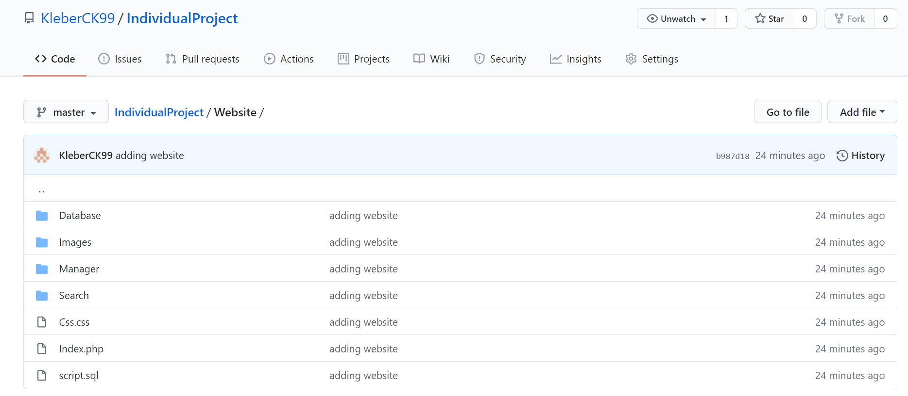
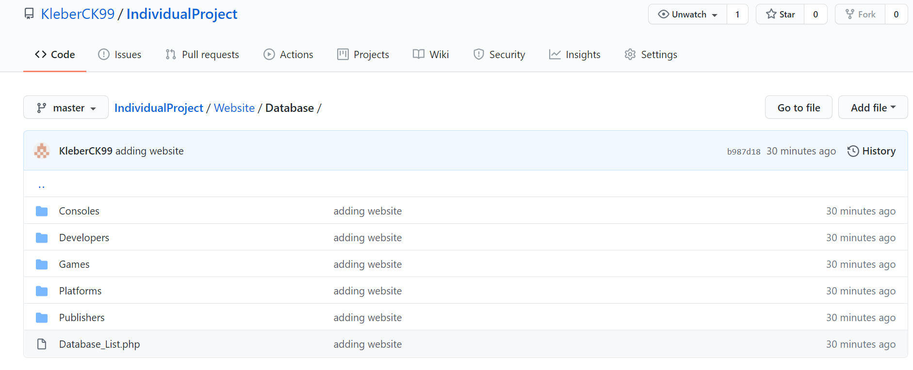
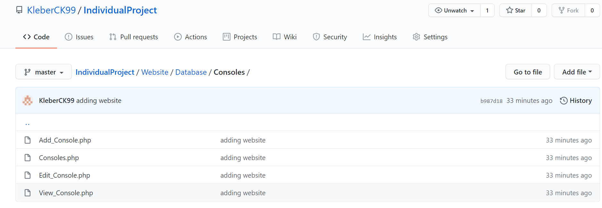
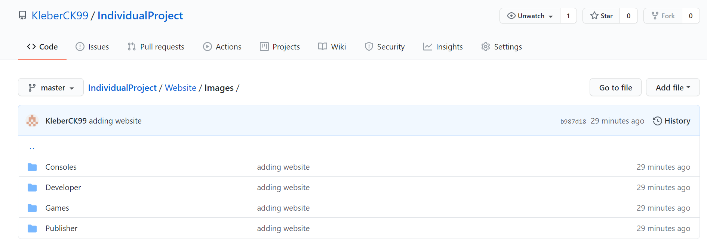
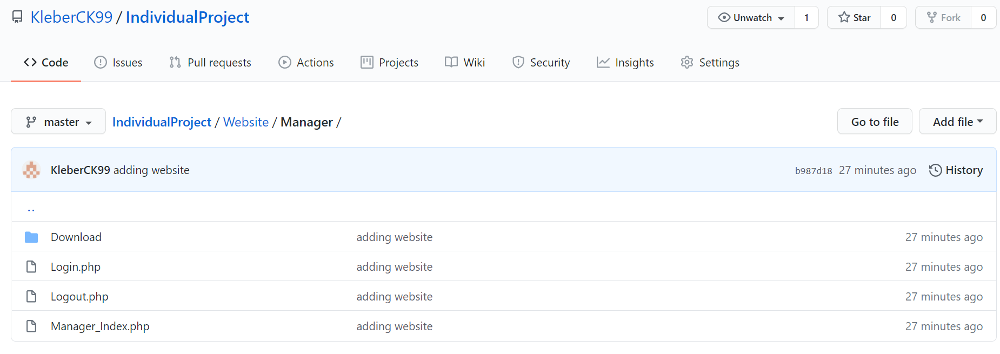
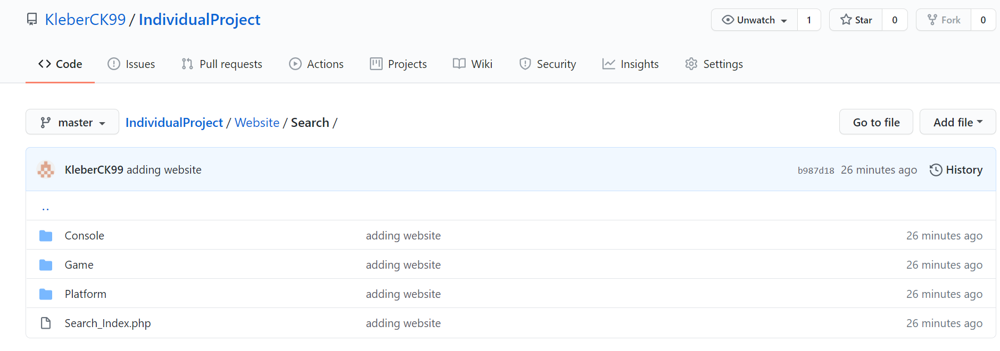
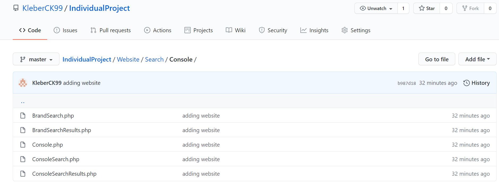

# IndividualProject
This repository contains a database management website I have created using PHP, HTML, CSS and MySQL.

# Directory Walkthrough
The rest of this document will contain a walkthrough of the files that make up my website.

## Website Folder

The three files in this folder are the homepage for my website (Index.php), the sql script that is used to create the database (script.sql) and the css file (Css.css) 
that controls the layout of each webpage.
For the remaining website pages I have split them into four folders: Database, Images, Manager & Search.

**Database Folder** 
The first folder (seen below) contains webpages that display the different tables in the database and allows the user to perform actions on these tables. 

The different tables have been seperated into folders and the Database_List.php page displays links to each of these folders. An example of one of the tables folders can be seen below.

Each folder will have the same files. The files in these folders will allow the user to view a table and view individual entities. Only a manager can use the add or edit pages.

**Images Folder** 
This folder contains images of every entity stored in the database. These images are displayed on the website in the database table pages.

**Manager Folder** 
The second folder in the main folder contains every Manager webpage. These are webpages that will allow a manager of the website to log in and make changes. There is
also a download folder that contains a test download page with three images. The website will allow the users to download these images from the page.

**Search Folder** 
Finally, the last folder contains webpages that will allow the user to search for certain entries in the database.

Similar, to the Database folder each table has been seperated into individual folders while the Search_Index.php page displays links to each table. An example of one of the folders can be seen below:

Each Folder will contain similar files. The pages in these folders will allow the user to search using a certain criteria and then the results will be displayed in a
seperate page.
